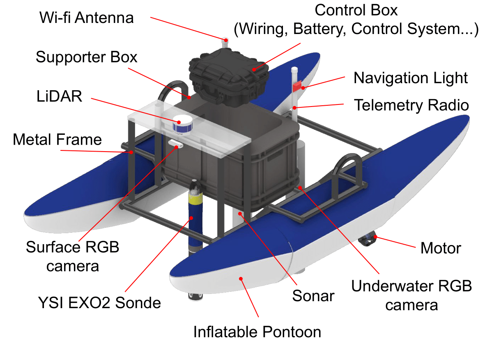

# epscor_asv_data_analysis
This is git repository for catabot data analysis for Lake monitoring.




## License
This project is licensed under the MIT License.

* Contributor: Mingi Jeong, Monika Roznere


## Prerequisites
You need to have Jupyter notebook and Python. 

## Modules
### 1. Telemetry log analyzer
This module converts .tlog file recorded from Mission Planner into .csv. 
Then, it is analyzed in the visualization notebook. 


### 2. .waypoint file converter to .csv
Python scripts to convert .waypoint file (used in Mission Planner) into .csv.


### 3. Quantitative data analysis and Visualization 
The Jupyter Notebooks have the following sub-modules. 
1. Time series data visualization
2. Spatial visualization


## Citation
If you use this package, please cite the following paper by Rozenere and Jeong et al 2021 for ISER (International Symposium on Experimental Robotics).

```buildoutcfg
@inproceedings{iser2021,
author = {Roznere, Monika and Jeong, Mingi and Maechling, Lily and Ward, Nicole K and Brentrup, Jennifer A and Steele, Bethel and Bruesewitz, Denise A and Ewing, Holly A and Weathers, Kathleen C and Cottingham, Kathryn L and {Quattrini Li}, Alberto},
booktitle = {Experimental Robotics},
isbn = {978-3-030-71151-1},
pages = {139--150},
publisher = {Springer International Publishing},
title = {{Towards a Reliable Heterogeneous Robotic Water Quality Monitoring System: An Experimental Analysis}},
year = {2021}
}
```